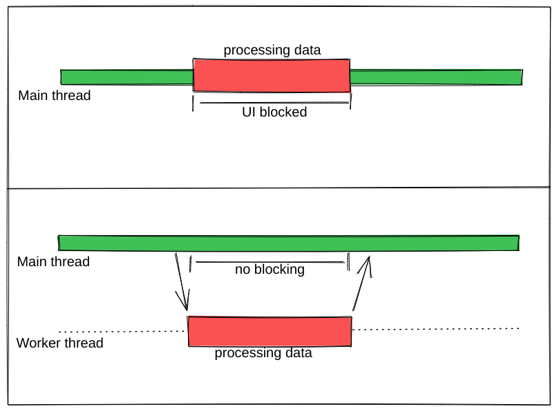

- [[everyday/react]]
	- ## Web Workers
		- Web Worker is a script that runs in the background without affecting the user interface, as it runs in a separate thread instead of the main thread. So it won’t cause any blocking to the user interaction. Web workers are primarily used to perform expensive tasks in a web browser, like sorting large numbers of data, CSV export, image manipulation, etc.
		- {:height 237, :width 330}
		- ## useWorker
			- [useWorker](https://github.com/alewin/useWorker) is a library to uses web worker APIs in a simple configuration with React Hooks. Which supports executing expensive tasks without blocking the UI, support promises instead of event listeners
	- ## Service Worker
		- A Service Worker is a script that runs in the background in a web browser, allowing a web app to control the cache and handle network requests, even when the user is offline. It provides a native-like performance and offline functionality to web apps as part of Progressive Web App (PWA) technology. Service Workers are event-driven, cache network requests, and can run even after the user closes the web app or the browser.
-